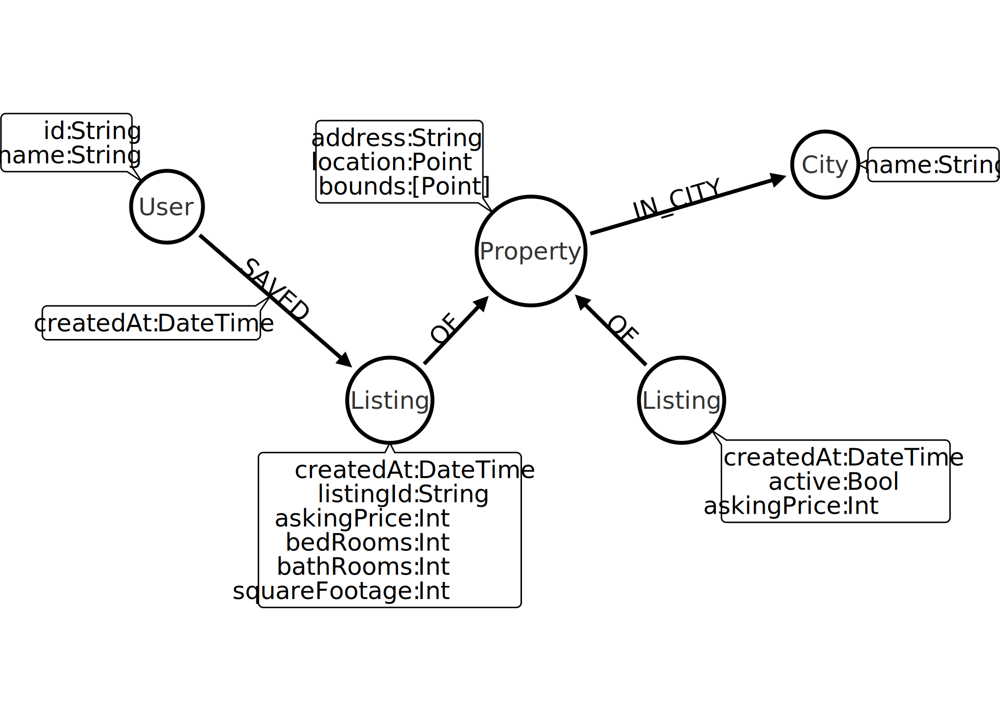
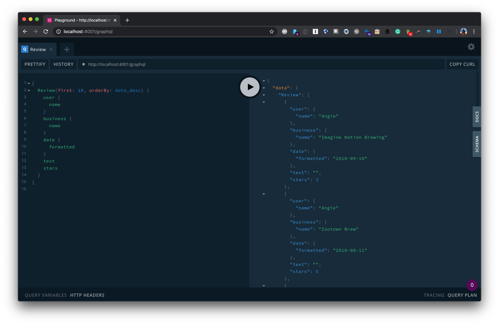

[](https://grandstack.io/deploy-starter-netlify) [](https://grandstack.io/deploy-starter-vercel) [](https://sandbox.neo4j.com/?usecase=blank-sandbox)

# Willow

A real estate search application built using GRANDstack.

## Data Model

<details>
  <summary>Arrows markup</summary>
  
  Markup for defining data model using the [Arrows graph diagraming tool](http://www.apcjones.com/arrows/)

```html
<ul
  class="graph-diagram-markup"
  data-internal-scale="1"
  data-external-scale="1"
>
  <li
    class="node"
    data-node-id="0"
    data-x="-693.8014526367188"
    data-y="-284.10595703125"
  >
    <span class="caption">User</span>
    <dl class="properties">
      <dt>id</dt>
      <dd>String</dd>
      <dt>name</dt>
      <dd>String</dd>
    </dl>
  </li>
  <li
    class="node"
    data-node-id="1"
    data-x="-280.34326171875"
    data-y="81.62985229492188"
  >
    <span class="caption">Listing</span>
    <dl class="properties">
      <dt>createdAt</dt>
      <dd>DateTime</dd>
      <dt>listingId</dt>
      <dd>String</dd>
      <dt>askingPrice</dt>
      <dd>Int</dd>
      <dt>bedRooms</dt>
      <dd>Int</dd>
    </dl>
  </li>
  <li
    class="node"
    data-node-id="2"
    data-x="647.443603515625"
    data-y="-415.84178161621094"
  >
    <span class="caption">City</span>
    <dl class="properties">
      <dt>name</dt>
      <dd>String</dd>
    </dl>
  </li>
  <li
    class="node"
    data-node-id="3"
    data-x="117.82290720939636"
    data-y="-248.87263107299805"
  >
    <span class="caption">Property</span>
    <dl class="properties">
      <dt>address</dt>
      <dd>String</dd>
      <dt>location</dt>
      <dd>Point</dd>
      <dt>bounds</dt>
      <dd>[Point]</dd>
    </dl>
  </li>
  <li
    class="node"
    data-node-id="4"
    data-x="480.4899597167969"
    data-y="115.72407531738281"
  >
    <span class="caption">Listing</span>
    <dl class="properties">
      <dt>createAt</dt>
      <dd>DateTime</dd>
      <dt>active</dt>
      <dd>Bool</dd>
    </dl>
  </li>
  <li class="relationship" data-from="0" data-to="1">
    <span class="type">SAVED</span>
    <dl class="properties">
      <dt>createdAt</dt>
      <dd>DateTime</dd>
    </dl>
  </li>
  <li class="relationship" data-from="1" data-to="3">
    <span class="type">OF</span>
  </li>
  <li class="relationship" data-from="4" data-to="3">
    <span class="type">OF</span>
  </li>
  <li class="relationship" data-from="2" data-to="3"></li>
</ul>
```

</details>



## Requirements

- As a user I want to search for properties for sale by city so that I can view property details.

```cypher
MATCH (l:Listing)-[:OF]-(p:Property)-[:IN]->(c:City)
WHERE c.name = "San Mateo"
```

- As a user I want to limit my search to properties with certain attributes or range of attributes so that I can narrow the results to those relevant to me.
- As a user searching for properties I want to view property details so I can learn more about the listing.

## GRANDstack Starter

This project was created using the GRANDstack Starter.

```
npx create-grandstack-app myNewApp
```

This project is a starter for building a [GRANDstack](https://grandstack.io) (GraphQL, React, Apollo, Neo4j Database) application. There are two components to the starter, the web frontend application (in React and Angular flavors) and the API app (GraphQL server).

[](http://www.youtube.com/watch?v=1JLs166lPcA 'Hands On With The GRANDstack Starter')

_Hands On With The GRANDstack Starter Video_

## Quickstart

The easiest way to get started with the GRANDstack Starter is to create a Neo4j Sandbox instance and use the `create-grandstack-app` command line tool.

### 1. Create A Neo4j Sandbox Instance

[Neo4j Sandbox](https://neo4j.com/sandbox) allows you to create a free hosted Neo4j instance private to you that can be used for development.

After singing in to Neo4j Sandbox, click the `+ New Project` button and select the "Blank Sandbox" option. In the next step we'll use the connection credentials from the "Connection details" tab to connect our GraphQL API to this Neo4j instance.


### 2. Run the `create-grandstack-app` CLI

```
npx create-grandstack-app myNewApp
```

or with Yarn

```
yarn create grandstack-app myNewApp
```


This will create a new directory `myNewApp`, download the latest release of the GRANDstack Starter, install dependencies and prompt for your connection credentials for Neo4j to connect to the GraphQL API.

### 3. Seed the database (optional)

Once the application is running, in another terminal run

```
npm run seedDb
```

or with Yarn

```
yarn run seedDb
```

### 4. Open In Browser


## Overview

The GRANDstack Starter is a monorepo that includes a GraphQL API application and client web applications for React (default) and Angular.

### `/` - Project Root

The root directory contains some global configuration and scripts:

- `npm run start` and `npm run build`
- ESLint (.eslintrc.json) for code linting
- Prettier (.prettierrc.json) for code formatting
- Git hooks for applying formatting on commit

### [`/api`](./api)



This directory contains the GraphQL API application using Apollo Server and neo4j-graphql.js.

- Change environment variable settings in `.env`:

```
# Use this file to set environment variables with credentials and configuration options
# This file is provided as an example and should be replaced with your own values
# You probably don't want to check this into version control!

NEO4J_URI=bolt://localhost:7687
NEO4J_USER=neo4j
NEO4J_PASSWORD=letmein

# Uncomment this line to enable encrypted driver connection for Neo4j
#NEO4J_ENCRYPTED=true

# Uncomment this line to specify a specific Neo4j database (v4.x+ only)
#NEO4J_DATABASE=neo4j

GRAPHQL_SERVER_HOST=0.0.0.0
GRAPHQL_SERVER_PORT=4001
GRAPHQL_SERVER_PATH=/graphql

```

### [`/web-react`](./web-react)


The frontend React web application is found in this directory.

It includes:

- Material UI
- React router
- Apollo Client / React Hooks
- Create React App

### [`/web-angular`](./web-angular)


A UI built with [Angular](https://angular.io), [Apollo](https://www.apollographql.com/docs/angular/) and the [Clarity Design System](https://clarity.design) is also available.

_Start the Angular UI server_

```
cd ./web-angular && npm start
```

See [the project releases](https://github.com/grand-stack/grand-stack-starter/releases) for the changelog.

## Deployment

### Netlify

This monorepo can be deployed to Netlify. The frontend application will be served over Netlify's CDN and the GraphQL API will be provisioned as a serverless GraphQL API lambda function deployed to AWS (via Netlify). A netlify.toml file is included with the necessary build configurations. The following environment variables must be set in Netlify (either via the Netlify web UI or via the command line tool)

```
NEO4J_URI
NEO4J_USER
NEO4J_PASSWORD
```

See the "Hands On With The GRANDStack Starter" video linked at the beginning of this README for a walkthrough of deploying to Netlify.

### Vercel / Zeit Now

Zeit Now v2 can be used with monorepos such as grand-stack-starter. [`now.json`](https://github.com/grand-stack/grand-stack-starter/blob/master/now.json) defines the configuration for deploying with Zeit Now v2.

1. Set the now secrets for your Neo4j instance:

```
now secret add grand_stack_starter_neo4j_uri bolt://<YOUR_NEO4J_INSTANCE_HERE>
now secret add grand_stack_starter_neo4j_user <YOUR_DATABASE_USERNAME_HERE>
now secret add grand_stack_starter_neo4j_password <YOUR_DATABASE_USER_PASSWORD_HERE>
```

2. Run `now`

## Docker Compose

You can quickly start via:

```
docker-compose up -d
```

If you want to load the example DB after the services have been started:

```
docker-compose run api npm run seedDb
```

You can find instructions for other ways to use Neo4j (Neo4j Desktop, Neo4j Aura, and other cloud services) in the [Neo4j directory README.](./neo4j)

This project is licensed under the Apache License v2.
Copyright (c) 2020 Neo4j, Inc.
